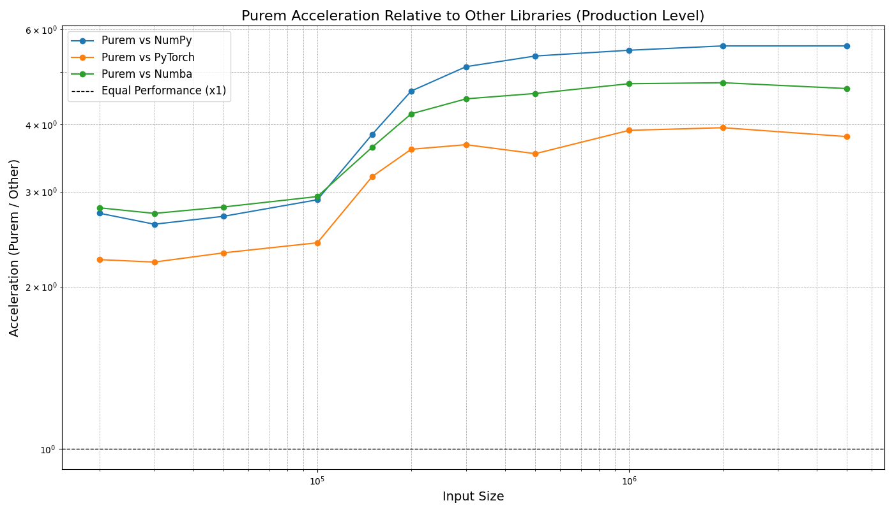
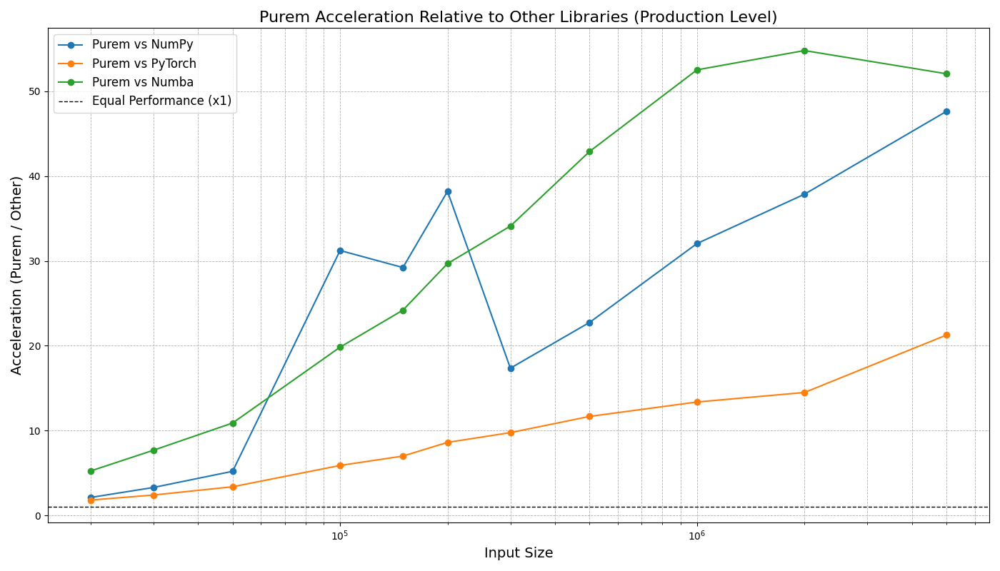
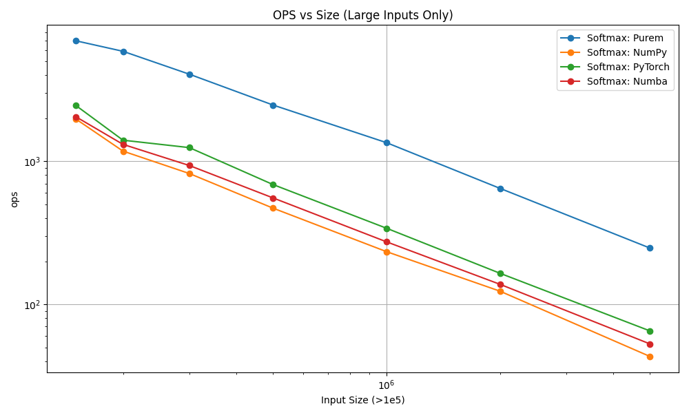
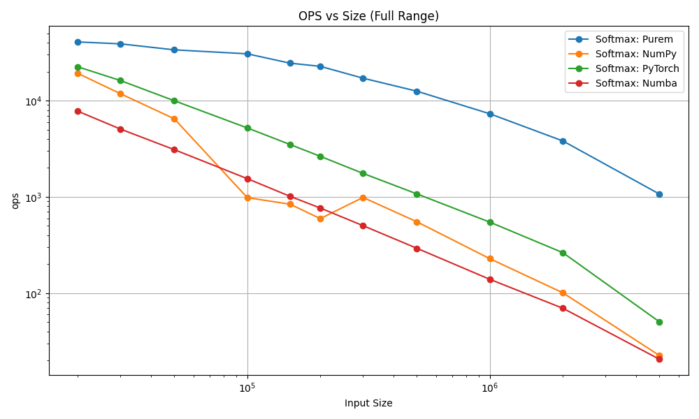
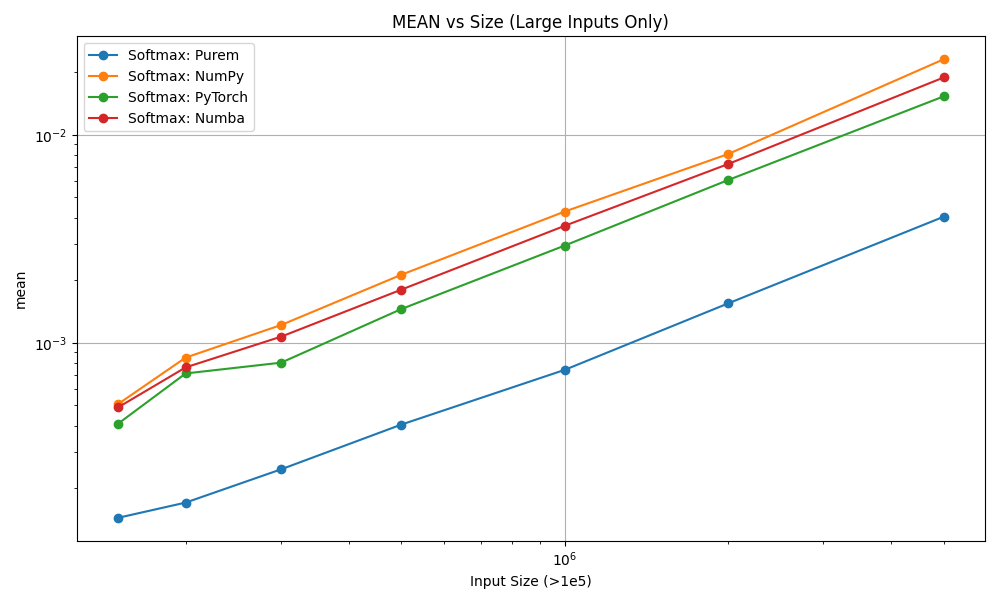
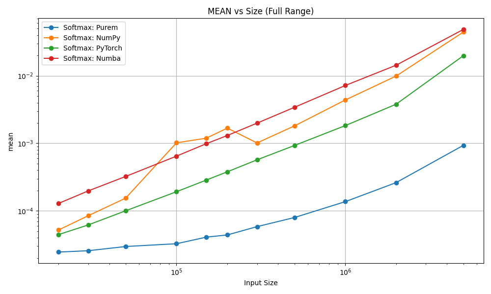

# Purem Benchmarks - High-Performance Mapping Operations
[](https://pypi.org/project/purem/)
[](https://developer.apple.com/documentation/apple-silicon)
[](https://worktif.com/documents/terms-of-service-sandbox)

---

## 📈 Performance Update – May 2025

🚀 Performance increased at least 2× across all benchmarks

We've revisited and optimized every core performance-critical path in Purem. Through a series of low-level enhancements and architecture-specific optimizations, the system now demonstrates at least double the speed compared to previous versions – with real-world benchmarks confirming these improvements on all supported platforms.

---

**The New Standard**  
Optimized for **x86-64**, **Intel**, and **ARM (Apple Silicon M1–M4)** servers.

---

## About

This repository contains **real-world benchmarks** for the Purem core technology, designed for **maximum performance testing** and **local validation**.

Purem now offers a **fully licensed and notarized sandbox binary** for **Apple Silicon M1 – M4** machines.

- **Unlimited**  
- **Unrestricted**  
- **No signup**  
- **No payment**  
- **No cloud dependencies**

You can **freely test and benchmark** Purem locally – the **same architecture**, the **same performance**, ready to run **directly on your Mac**.

---

## Key Highlights

- ⚡ **Full support for x86-64 and ARM64 (Apple M1–M4) architectures.**
- ⚡ **Production-grade benchmark scripts** included.
- ⚡ **Optimized Softmax computation** using **NumPy + Numba** (maximum CPU utilization).
- ⚡ **Parallelized and vectorized execution** for massive data sizes (millions to billions of elements).
- ⚡ **Accurate cost estimation for cloud and serverless environments** (AWS Lambda, Azure Functions, etc.).
- ⚡ **Focus on real hardware performance, not synthetic scores.**

---

## Getting Started

### Requirements

- Python 3.11+
- `purem`
- `numpy`
- `numba`
- `torch`
- `pandas`
- `scipy`
- `pytest`
- `matplotlib`
- MacBook or Mac server with Apple Silicon (M1–M4) – **or any x86-64 server** with supported Purem license.

#### About the Makefile
- 🧠 This project includes a Makefile for internal tasks like testing.
- 👉 You can run it if you like – it won't affect the project or cause any issues.

However, to perform full tests and benchmarks properly, please follow the official usage instructions. Just use the project as normal.

### Installation

Clone the repository:

```bash
git clone https://github.com/worktif/purem_sandbox.git
cd purem_sandbox
```

Install dependencies:

```bash
pip install -r requirements.txt
```

### Running Benchmarks


#### Supported Architectures

We support both modern Apple Silicon and traditional Intel/AMD CPUs:

🔹 For Apple Silicon (ARM64, M1–M4 chips)

```shell
make test_arm
```

Runs all tests compiled for ARM64 – optimized for performance on Apple hardware.

🔹 For Intel/AMD (x86_64)

```shell
make test_x86
```

#### 🚀 Launch your own environment

To launch your own environment on AWS, simply run:

```shell
make launch_ec2_instance
```

This command uses the predefined environment variables and provisions your setup automatically.

Make sure to define the following environment variables before running the command:

```shell
export AMI_ID=ami-xxxxxxxxxxxxxxxxx
export INSTANCE_TYPE=t3.micro
export AWS_KEY_NAME=my-keypair
export AWS_SECURITY_GROUP=sg-xxxxxxxx
export AWS_SUBNET_ID=subnet-xxxxxxxx
```

That's it – your personal environment will be up and running in the cloud.

##### ℹ️ What is AMI_ID?

As Ubuntu cloud images are uploaded and registered on the Amazon EC2 cloud, they are referred to as AMI (Amazon Machine Images). Each AMI is a machine template from which you can instantiate new servers. Each AMI has its own unique ID. In order to launch an instance on the EC2 cloud, you first need to locate its ID. This page helps you quickly locate an AMI ID.

You can find the latest official Ubuntu AMIs for your region here:

👉 [Ubuntu EC2 AMI Locator](https://cloud-images.ubuntu.com/locator/ec2/)

Use the link to select the Ubuntu version, region (e.g., us-east-1, eu-west-1), and architecture (arm64 or amd64) that matches your environment.

Runs all tests compiled for x86_64 platforms – validated on most Linux and Windows systems.

Tip: Want to verify your setup before using the library in production?
Run the appropriate test command above based on your machine's architecture.

#### 💡 Flexible Testing on Any EC2 Instance

You can run benchmarks on any EC2 instance type – whether ARM64 (e.g., Graviton) or x86_64 (e.g., Intel/AMD).
The test flow is fully automated: it launches your instance, runs benchmarks, and shuts it down immediately.

✅ Cost-efficient by design

Don't worry about high costs – the process is optimized:
 - 💾 You only pay for allocated memory, not for long instance uptime.
 - ⏱️ Billing is per-second (with a minimum of 60 seconds).
 - ⚡ Benchmarks run quickly, so usage time is minimal.

This makes it safe and affordable to run benchmarks on powerful EC2 types without committing to long-lived resources.


Generates full performance plots under `src/purem_benchmarks/` showing a runtime vs input size.

Check it out: [CI/CD Purem Benchmarks](https://github.com/worktif/purem_sandbox/actions)

---


## 📊 Benchmark Highlights

Here's a quick look at how Purem compares to existing Python ML libraries:
Вот аккуратно оформленная **Markdown таблица**, сравнивающая результаты для `ARM64` и `x86_64` по тем же трём категориям с подписями и изображениями:

---

### 📊 Benchmark Comparison: ARM64 vs x86\_64

| Metric                                              | ARM64                                                             | x86\_64                                                           |
|-----------------------------------------------------| ----------------------------------------------------------------- |-------------------------------------------------------------------|
| *Acceleration (Purem vs NumPy, PyTorch, Numba)*     |  |  |
| *Operations per second on large inputs (log scale)* |                    |                     |
| *Mean numerical error – lower = better*             |             |              |


💡 **Note**: All benchmarks were run under identical conditions per architecture to ensure fair comparison.

---

### ⚡ Insane Speed Gains on x86_64

Purem obliterates the performance of traditional numeric libraries on x86 systems. The numbers speak for themselves:
 - 🔥 Up to 20× faster than PyTorch on real-world vector workloads.
 - 🚀 50× faster than NumPy, even in optimized scenarios.
 - ⚡ Outruns Numba by a wide margin under pressure.

We're not talking about micro-benchmarks. This is raw, scalable, memory-aligned performance – exactly where other libraries choke on overhead and wasted CPU cycles.

Purem is built for one thing only: *absolute throughput*.
No interpreter lag. No fat. Just clean, low-level SIMD-powered execution – tuned for AVX2, AVX-512, and engineered to melt through millions of ops per second.

🧠 If you're still using NumPy or PyTorch for heavy lifting on x86, you're not just leaving 90% of your CPU on the table — you're burning 90% of your budget for nothing.

---

## Licensing

- **Apple Silicon (M1–M4):**  
  The sandbox binary is **permanently free to use** – no registration required.  
  You can **fully develop, benchmark, and integrate** locally.

- **x86-64 Servers (Intel/AMD):**  
  A separate licensed version is available.  
  Please refer to the [Purem by Work TIF website](https://www.worktif.com) for more details.

---

## Important Dates

- 🗓️ **Sandbox Version Public Release:**  
  **April 28th, 2025**

---

## Why Benchmark with Purem?

By using the free sandbox, you can:

- Validate performance claims **locally**.
- Benchmark **your own models** with production-grade accuracy.
- Optimize cloud costs based on **real runtime data**.
- Prepare real-world production integrations **with no vendor lock-in**.

---

## Contact

For more information and licensing inquiries, please visit the [Purem by Work TIF Official Website](https://www.worktif.com).

---

> **Purem – Engineering the New Standard of Performance.**